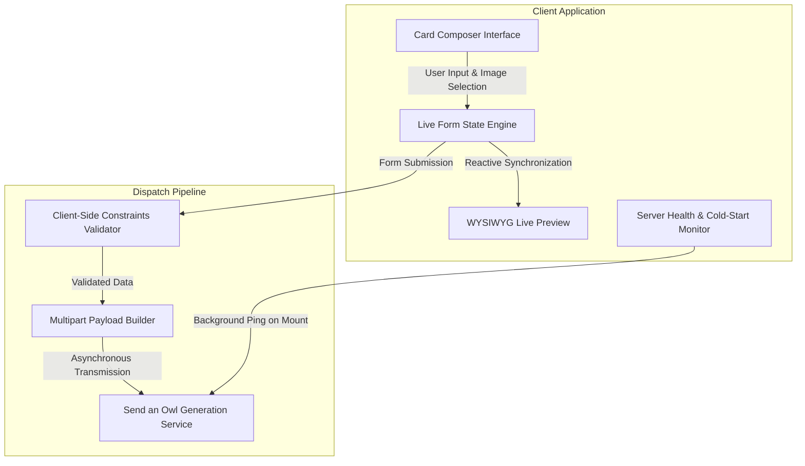
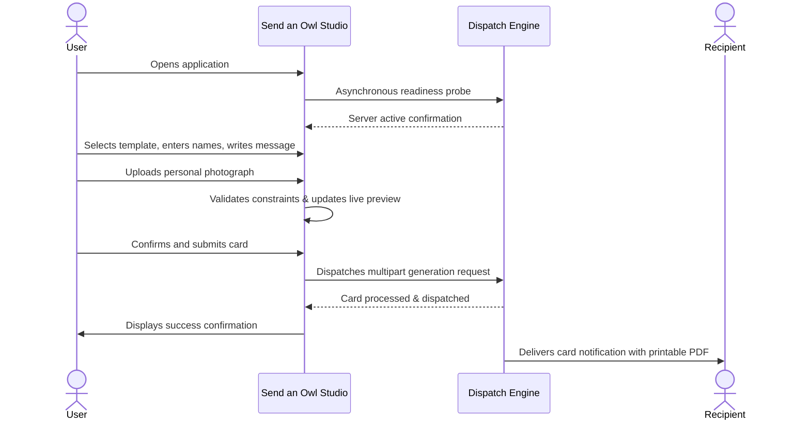

# Send an Owl - Web Application

Send an Owl is a digital greeting card studio designed to create personalized, print-ready birthday cards with real-time visual feedback and automated delivery.

The application combines a focused card composer with an interactive live preview, allowing users to select designs, upload imagery, and craft heartfelt messages before dispatching them directly to recipients.

---

## Architecture

---

## Application Experience

### Real-Time WYSIWYG Composer
As users enter recipient details, compose greetings, and upload photos, the preview pane mirrors changes instantaneously. This eliminates guesswork, ensuring the physical and digital card layout appears exactly as intended.

### Dynamic Photo Framing
Users can personalize their greeting with photographs in standard image formats (JPEG, PNG, WebP, GIF). The composer automatically processes, scales, and centers photos within a circular vignette frame suited for greeting card prints.

### Server Readiness & Cold-Start Handling
When deployed alongside sleep-enabled or serverless infrastructure, the application unobtrusively pings the processing backend upon initial page load. A compact status indicator informs the user while the server initializes in the background, ensuring smooth card generation without submission timeouts.

### Typography and Aesthetics
The interface uses a warm, editorial aesthetic inspired by vintage stationery and autumnal tones, paired with structured typography:
- Display headings set in Playfair Display
- Script greetings styled in Dancing Script
- Interface elements and user messages set in Inter for legibility

---

## Core Workflow

---

## Technical Foundation

- **User Interface:** React 18
- **Styling Architecture:** Tailwind CSS with custom editorial design tokens
- **Animations & Micro-interactions:** Framer Motion
- **Build System:** Vite
- **Asset Processing:** Dynamic browser-level object URLs for zero-latency image previews

---

## Privacy and Data Handling

The frontend does not persist user inputs or imagery to local storage or external tracking databases. Uploaded images are held in volatile memory strictly for preview rendering and transmission to the generation engine, after which object references are revoked.
